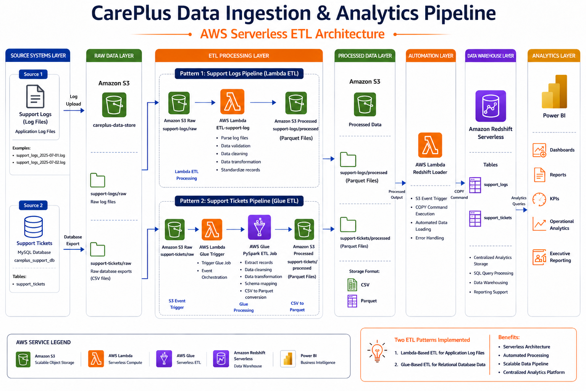

# 🚀 CarePlus Data Ingestion & Analytics Pipeline

## 📌 Overview

The **CarePlus Data Ingestion & Analytics Pipeline** is a serverless AWS data engineering solution that automates the ingestion, transformation, and loading of customer support datasets into Amazon Redshift for analytics and reporting.

This project demonstrates two ETL implementation approaches:

### 🔹 Lambda-Based ETL Pipeline (Support Logs)

```text
                   ┌─────────────────┐
                   │  Support Logs   │
                   │   (.log Files)  │
                   └────────┬────────┘
                            │
                            ▼
                   Amazon S3 (Raw)
                            │
                            ▼
                    Lambda ETL
                            │
                            ▼
                   Amazon S3 (Processed)
                            │
                            ▼
                    Lambda Loader
                            │
                            ▼
                Amazon Redshift Serverless
```

### 🔹 Glue-Based ETL Pipeline (Support Tickets)

```text

                   ┌─────────────────┐
                   │ Support Tickets │
                   │ MySQL Database  │
                   └────────┬────────┘
                            │
                            ▼
                   Amazon S3 (Raw)
                            │
                            ▼
                  Lambda Trigger
                            │
                            ▼
                        AWS Glue
                       PySpark ETL
                            │
                            ▼
                   Amazon S3 (Processed)
                            │
                            ▼
                    Lambda Loader
                            │
                            ▼
                Amazon Redshift Serverless

                            │
                            ▼
                         Power BI
```

The solution showcases event-driven architecture, serverless computing, ETL automation, and cloud data warehousing using AWS services.

---

# 🏗️ Solution Architecture



---

# 🎯 Business Requirement

CarePlus handles large volumes of customer support interactions through tickets and operational logs. These datasets are generated continuously and require a centralized platform for storage, processing, and analytics.

The organization requires a solution that can:

* Collect support ticket and support log data from multiple sources.
* Store raw and processed datasets in a centralized data lake.
* Automate ETL workflows with minimal manual intervention.
* Process newly arrived files in near real-time.
* Load transformed datasets into a centralized data warehouse.
* Enable business users to perform analytics and reporting.
* Scale efficiently as data volumes grow.
* Reduce operational overhead through serverless services.

---

# ☁️ AWS Services Used

| Service                    | Purpose                       |
| -------------------------- | ----------------------------- |
| Amazon S3                  | Raw & Processed Data Storage  |
| AWS Lambda                 | Event-Driven ETL & Automation |
| AWS Glue                   | ETL Processing using PySpark  |
| Amazon Redshift Serverless | Data Warehouse                |
| AWS IAM                    | Access Management             |
| Amazon CloudWatch          | Monitoring & Logging          |
| Power BI                   | Reporting & Analytics         |

---

# 📐 Architecture Components

| Layer                | Service                       | Purpose              |
| -------------------- | ----------------------------- | -------------------- |
| Source Layer         | Support Logs, Support Tickets | Raw Data Sources     |
| Raw Layer            | Amazon S3                     | Landing Zone         |
| ETL Layer            | Lambda / Glue                 | Data Transformation  |
| Processed Layer      | Amazon S3                     | Curated Data Storage |
| Automation Layer     | AWS Lambda                    | Redshift Loading     |
| Data Warehouse Layer | Amazon Redshift Serverless    | Analytics Storage    |
| Reporting Layer      | Power BI                      | Dashboards & Reports |

---

# 📂 Project Structure

```text
Project_01_AWS_ETL_Pipeline/
│
├── architecture/
│
├── config/
│   └── config.py
│
├── dashboard/
│   ├── FastAPI/
│   │   ├── app/
│   │   ├── static/
│   │   ├── requirements.txt
│   │   ├── run.py
│   │   └── .env
│   └── Power BI/
│       └── Careplus Insights.pbix
│
├── datasets/
│   ├── support-logs/
│   │   └── day-wise-logs-data/
│   │
│   └── support-tickets/
│       └── sql/
│           └── careplus_support_db.sql
│
├── docs/
│   ├── AWS_Athena/
│   │   ├── screenshots/
│   │   └── README.md
│   │
│   ├── AWS_Glue/
│   │   ├── screenshots/
│   │   └── README.md
│   │
│   ├── AWS_Lambda_Setup/
│   │   ├── screenshots/
│   │   └── README.md
│   │
│   ├── AWS_Redshift/
│   │   ├── screenshots/
│   │   └── README.md
│   │
│   ├── AWS_S3_Setup/
│   │   ├── screenshots/
│   │   ├── README.md
│   │   └── 01_S3_Bucket_Setup.md
│   │
│   └── ../
│
├── ingestion/
│   ├── glue/
│   │   ├── glue_run_job.py
│   │   └── lambda_glue_trigger.py
│   │
│   ├── lambda/
│   │   └── ETL-support-log.py
│   │
│   ├── redshift/
│   │   ├── lambda_redshift_trigger.py
│   │   ├── table_creation_query.py
│   │   ├── sql_query.sql
│   │   └── table_schema/
│   │
│   ├── support-logs/
│   │   ├── extract_data.py
│   │   ├── support_logs_ingestion_to_S3.py
│   │   ├── support_logs_2025-07-01.log
│   │   └── log_date_tracker.txt
│   │
│   └── support-tickets/
│       ├── support_tickets_ingestion_to_S3.py
│       └── date_tracker.txt
│
├── .env
├── .gitignore
├── requirements.txt
└── README.md
```

---

# 🔄 Data Flow

## 📝 Support Logs Pipeline (Lambda ETL)

### Workflow

```text
      Support Logs
           ↓
   Amazon S3 Raw Layer
           ↓
     AWS Lambda ETL
           ↓
Amazon S3 Processed Layer
           ↓
    AWS Lambda Loader
           ↓
    Amazon Redshift
           ↓
      ┌────┴────┐
      ▼         ▼
   FastAPI   Power BI
 Dashboard   Reports
```

### Process

1. Log files are uploaded to the Amazon S3 Raw Layer.
2. An S3 event triggers the Lambda ETL function.
3. Lambda cleans and transforms log data.
4. Processed output is written to the Processed S3 Layer.
5. A second Lambda function executes a Redshift COPY command.
6. Data is loaded into Amazon Redshift.
7. Power BI dashboards consume the warehouse data.

---

## 📋 Support Tickets Pipeline (Glue ETL)

### Workflow

```text
    Support Tickets
           ↓
  Amazon S3 Raw Layer
           ↓
   AWS Lambda Trigger
           ↓
   AWS Glue ETL Job
           ↓
 Amazon S3 Processed Layer
           ↓
   AWS Lambda Loader
           ↓
     Amazon Redshift
           ↓
      ┌────┴────┐
      ▼         ▼
   FastAPI   Power BI
 Dashboard   Reports
```

### Process

1. Ticket data files are uploaded to Amazon S3.
2. S3 events trigger a Lambda function.
3. Lambda starts an AWS Glue PySpark job.
4. Glue transforms and cleans the dataset.
5. Output files are stored in Parquet format.
6. Lambda loads the processed data into Redshift.
7. Analytics users access the data through Power BI.

---

# 🪣 Amazon S3 Data Lake Structure

```text
careplus-data-store/
│
├── support-logs/
│   ├── raw/
│   └── processed/
│
└── support-tickets/
    ├── raw/
    └── processed/
```

---

# 📊 Amazon Redshift Tables

```sql
support_logs

support_tickets
```

---

# 🔐 IAM Security

IAM roles and policies are used to enable secure communication between AWS services.

### Permissions

* AWS Lambda → Amazon S3
* AWS Lambda → AWS Glue
* AWS Lambda → Amazon Redshift
* AWS Glue → Amazon S3
* Amazon Redshift → Amazon S3

The solution follows the Principle of Least Privilege (PoLP).

---

# 📈 Reporting & Analytics

Data stored in Amazon Redshift is used by Power BI dashboards for:

* Support Ticket Analysis
* Ticket Volume Trends
* Daily Support Log Monitoring
* Operational KPI Tracking
* Business Performance Reporting
* Data-Driven Decision Making

---

# 📈 Benefits

### 🚀 Faster Data Availability

Automated pipelines ensure support data becomes available for reporting shortly after ingestion.

### ⚡ Reduced Manual Effort

Event-driven workflows eliminate manual ETL execution and reduce operational tasks.

### ☁️ Serverless Scalability

AWS Lambda and AWS Glue automatically scale based on workload demands.

### 💰 Cost Optimization

Amazon S3 and Parquet storage reduce storage costs and improve analytics performance.

### 📊 Centralized Analytics

Amazon Redshift provides a single source of truth for reporting and dashboarding.

### 🔄 Automated Data Processing

Support logs and support tickets are automatically transformed and loaded.

### 📈 Improved Decision Making

Business users gain timely access to operational and support metrics.

---

# 🛠️ Technology Stack

| Category                  | Technology                 |
| ------------------------- | -------------------------- |
| Cloud Platform            | AWS                        |
| Data Lake                 | Amazon S3                  |
| ETL Processing            | AWS Lambda                 |
| ETL Processing            | AWS Glue                   |
| Data Transformation       | PySpark                    |
| Data Warehouse            | Amazon Redshift Serverless |
| Programming Language      | Python                     |
| Query Language            | SQL                        |
| Reporting & Visualization | Power BI                   |
| Security                  | AWS IAM                    |
| Monitoring                | Amazon CloudWatch          |
| Data Format               | CSV, Parquet               |
| Version Control           | Git & GitHub               |

---

# 📊 Solution Highlights

| Metric               | Value                      |
| -------------------- | -------------------------- |
| Architecture Style   | Serverless                 |
| Data Lake            | Amazon S3                  |
| ETL Engines          | AWS Lambda & AWS Glue      |
| Storage Format       | Parquet                    |
| Data Warehouse       | Amazon Redshift Serverless |
| Analytics Tool       | Power BI                   |
| Scalability          | High                       |
| Operational Overhead | Low                        |

---

# ✨ Key Features

* Automated Data Ingestion
* Event-Driven Processing
* Lambda-Based ETL
* Glue-Based ETL
* Serverless Architecture
* Redshift Data Warehouse
* Automated Data Loading
* Analytics-Ready Data
* Cost-Optimized Storage
* Modular Pipeline Design

---

# 🎯 Skills Demonstrated

* Data Engineering
* AWS Lambda
* AWS Glue
* Amazon S3
* Amazon Redshift
* PySpark
* ETL Pipeline Development
* Data Warehousing
* Event-Driven Architecture
* Serverless Computing
* Cloud Data Engineering
* Data Lake Architecture
* SQL Development

---

# 🔮 Future Enhancements

* Data Quality Validation Framework
* ETL Monitoring Dashboard
* CloudWatch Alerts
* Incremental Data Loading
* CI/CD Pipeline
* Data Catalog Integration
* Automated Testing Framework

---

# 🎉 Outcome

The CarePlus Data Ingestion & Analytics Pipeline demonstrates two serverless ETL implementation patterns using AWS Lambda and AWS Glue. The solution automates data ingestion, transformation, and loading into Amazon Redshift, providing a scalable foundation for analytics, reporting, and operational insights while minimizing infrastructure management and operational overhead.
