# 🔍 AWS Athena & AWS Glue Crawler Setup

This guide explains how to configure Amazon Athena and AWS Glue Crawlers to query processed data stored in Amazon S3.

---

## 📌 Overview

The processed files generated by the ETL pipeline are stored in Amazon S3. AWS Glue Crawlers scan the processed files, automatically infer the schema, and create metadata tables in the AWS Glue Data Catalog. Amazon Athena then uses these catalog tables to run SQL queries directly on data stored in S3.

---

## 🏗️ Architecture

```text
Amazon S3 (Processed Data)
            │
            ▼
     AWS Glue Crawler
            │
            ▼
   AWS Glue Data Catalog
            │
            ▼
      Amazon Athena
            │
            ▼
       SQL Analytics
```

---

# Part 1: Configure Amazon Athena

## Step 1: Open Athena Query Editor

Navigate to:

```text
AWS Console
 └── Amazon Athena
      └── Launch Query Editor
```

### Screenshot

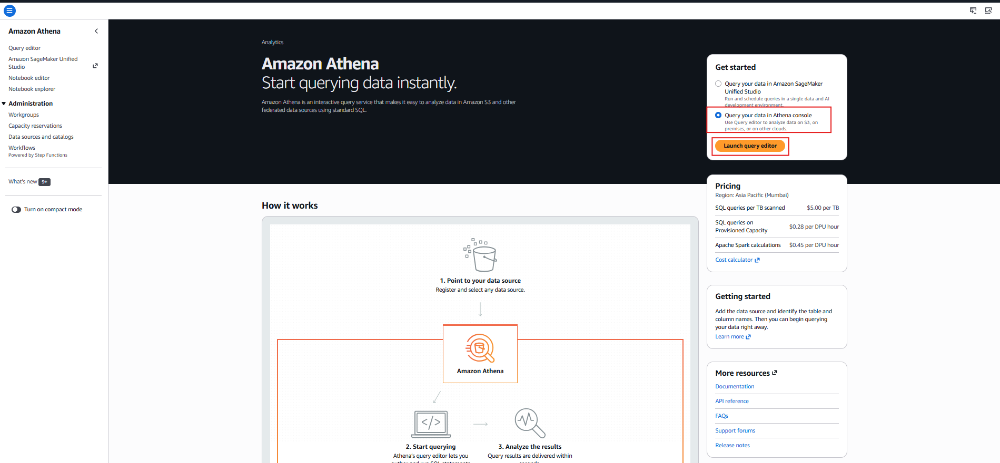

---

## Step 2: Configure Query Result Location

Athena requires an S3 location where query results will be stored.

Click:

```text
Edit Settings
```

### Screenshot

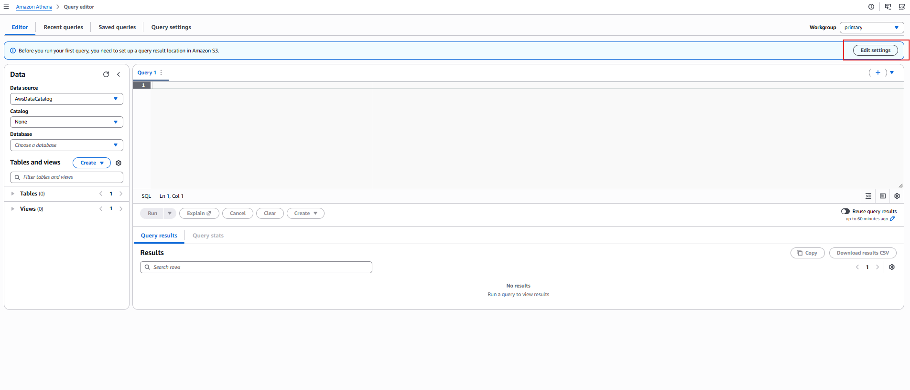

---

## Step 3: Configure Query Results Bucket

Provide an S3 location:

```text
s3://careplus-athena-results/
```

Click **Save**.

### Screenshot

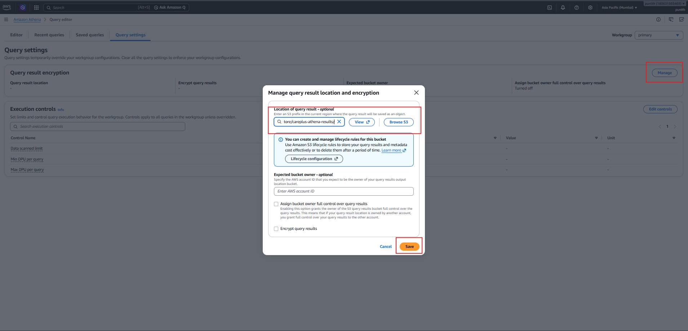

---

## Step 4: Create Athena Database

Execute the following SQL query:

```sql
CREATE DATABASE careplus_db;
```

Verify that the database is created successfully.

### Screenshot

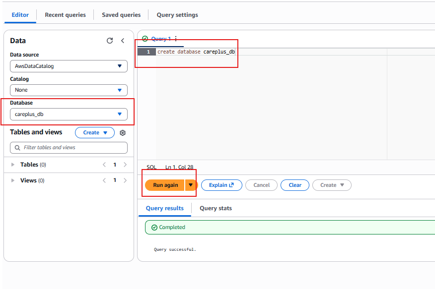

---

# Part 2: Create AWS Glue Crawler

## Step 5: Start Glue Crawler Creation

Navigate to:

```text
Tables and Views
 └── Create
      └── AWS Glue Crawler
```

### Screenshot

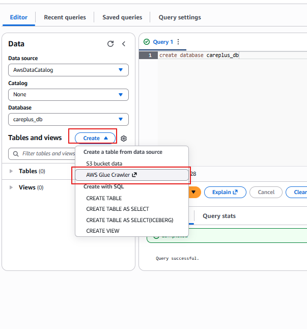

---

## Step 6: Configure Crawler Name

Provide a crawler name:

```text
crawler_support_logs
```

Click **Next**.

### Screenshot

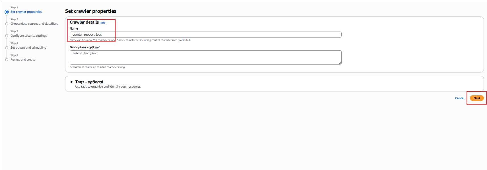

---

## Step 7: Add Data Source

Choose:

```text
Amazon S3
```

Click **Add Data Source**.

### Screenshot

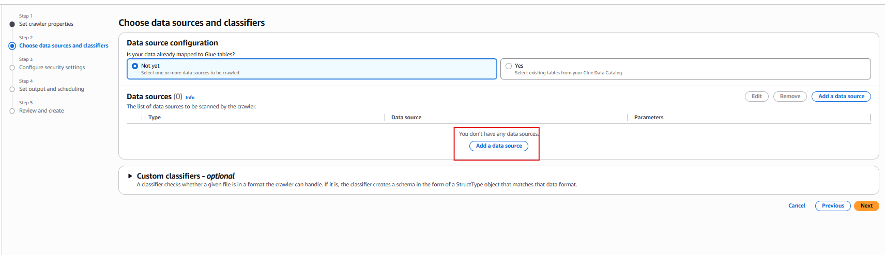

---

## Step 8: Select Processed S3 Folder

Specify the location of processed files:

```text
s3://careplus-data-demo-store/support-logs/processed/
```

The crawler will scan all files inside this folder.

### Screenshot

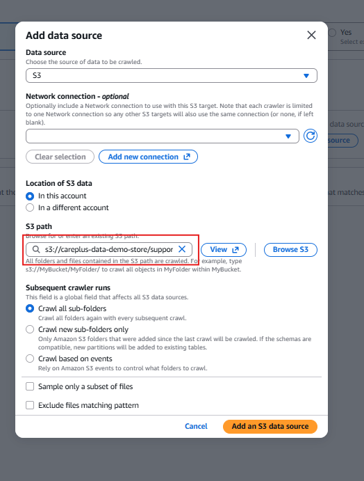

---

## Step 9: Configure IAM Role

Create or select the IAM role:

```text
AWSGlueServiceRole-support-logs
```

Required permissions:

* Amazon S3
* AWS Glue
* CloudWatch Logs

### Screenshot

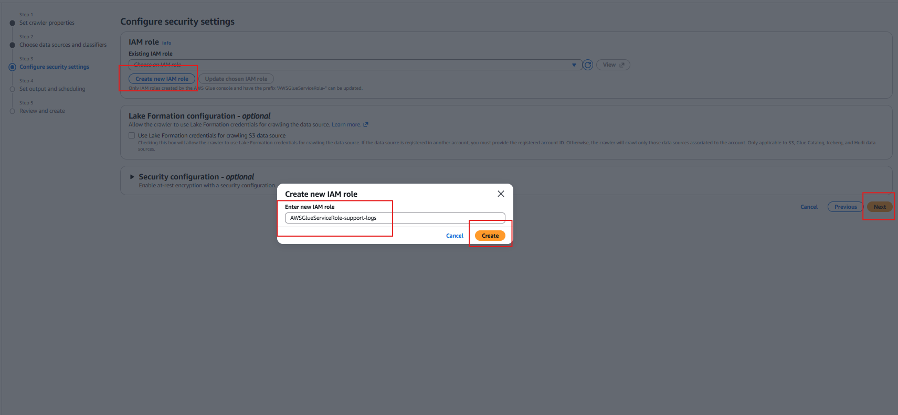

---

## Step 10: Configure Output Settings

Database:

```text
careplus_db
```

Table Prefix:

```text
support_logs_
```

Crawler Schedule:

```text
On Demand
```

### Screenshot

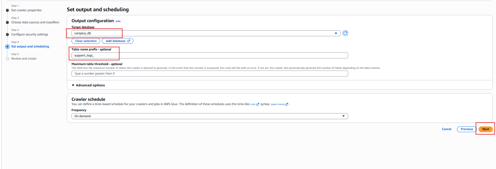

---

## Step 11: Review and Create Crawler

Review the configuration and click:

```text
Create Crawler
```

### Screenshot

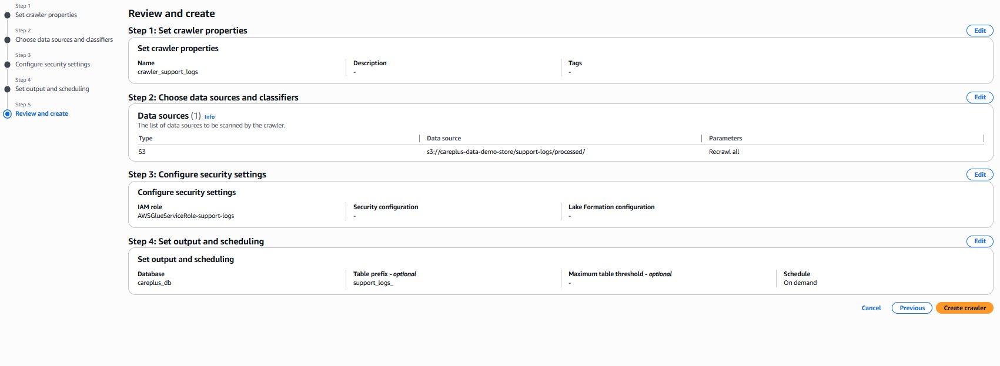

---

# Part 3: Run the Crawler

## Step 12: Execute Crawler

Click:

```text
Run Crawler
```

The crawler will:

1. Scan S3 files
2. Detect schema
3. Create Glue Catalog tables
4. Register metadata for Athena

### Screenshot

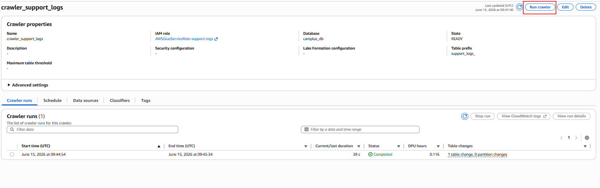

---

## Step 13: Verify Table Creation

After successful execution, the crawler creates a table inside the Glue Data Catalog.

Database:

```text
careplus_db
```

Generated Table:

```text
support_logs_processed
```

### Screenshot

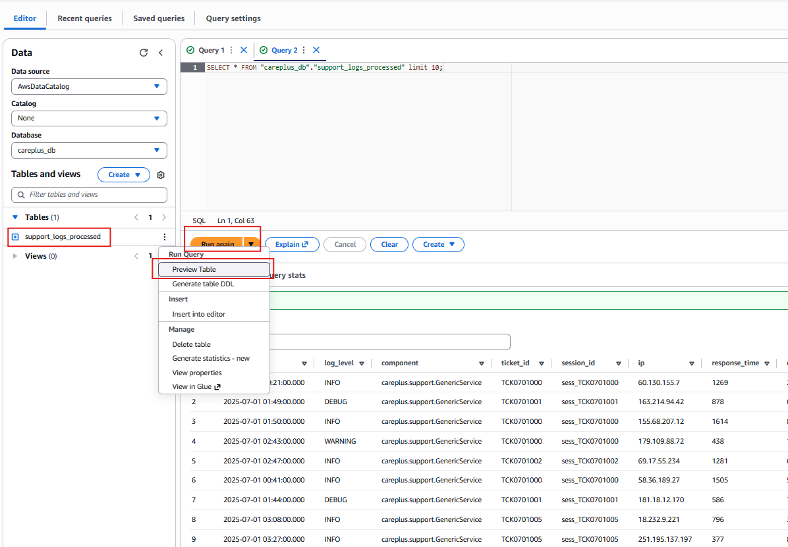

---

# Query Data Using Athena

## Preview Records

```sql
SELECT *
FROM careplus_db.support_logs_processed
LIMIT 10;
```

---

## Count Records

```sql
SELECT COUNT(*) AS total_records
FROM careplus_db.support_logs_processed;
```

---

## Average Response Time

```sql
SELECT AVG(response_time) AS avg_response_time
FROM careplus_db.support_logs_processed;
```

---

## Records by Log Level

```sql
SELECT
    log_level,
    COUNT(*) AS total_records
FROM careplus_db.support_logs_processed
GROUP BY log_level
ORDER BY total_records DESC;
```

---

## Top 10 Slowest Requests

```sql
SELECT
    ticket_id,
    response_time
FROM careplus_db.support_logs_processed
ORDER BY response_time DESC
LIMIT 10;
```

---

# Benefits of Using Athena + Glue Crawler

✅ Fully Serverless

✅ No Infrastructure Management

✅ Automatic Schema Discovery

✅ Direct Querying of S3 Data

✅ Pay Only for Queries Executed

✅ Easy Integration with Data Lakes

---

# Outcome

After completing this setup:

* Processed files are stored in Amazon S3.
* AWS Glue Crawlers automatically discover schemas.
* Metadata is stored in the AWS Glue Data Catalog.
* Athena queries data directly from S3.
* Analytics can be performed using standard SQL without managing servers.

This architecture provides a scalable, serverless, and cost-effective analytics solution on AWS.
