# 🚀 AWS Glue Visual ETL Pipeline – Support Ticket Data Processing


---

## 📖 Project Overview

This project demonstrates how to build an end-to-end **AWS Glue Visual ETL Pipeline** for processing customer support ticket data stored in Amazon S3.

The pipeline performs:

* 📥 Data Ingestion from Amazon S3
* 🔄 Schema Mapping & Data Type Conversion
* 🧹 Null Value Handling
* 📝 Column Renaming
* 🔍 Data Filtering
* ⚡ SQL-Based Data Transformation
* 📦 Export to Optimized Parquet Format

---

## 🏗️ Architecture

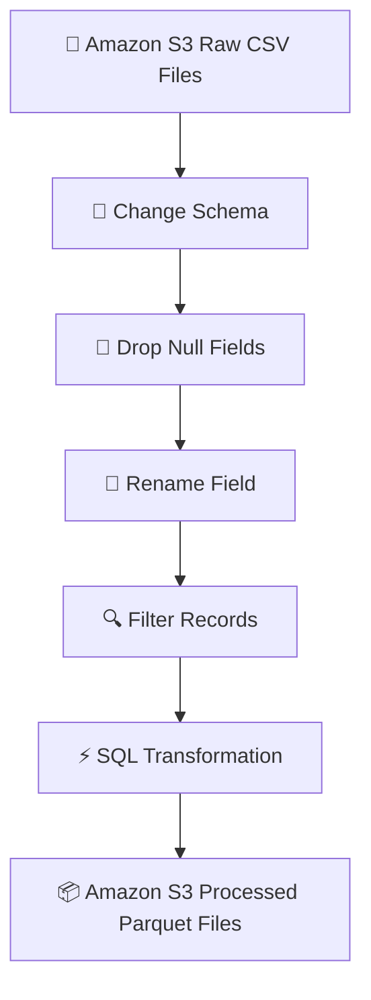

---

# 🔐 Step 1 – Create IAM Role for AWS Glue

Navigate to:

```text
IAM → Roles → Create Role
```

Select:

* AWS Service
* Glue

## 📸 Screenshot

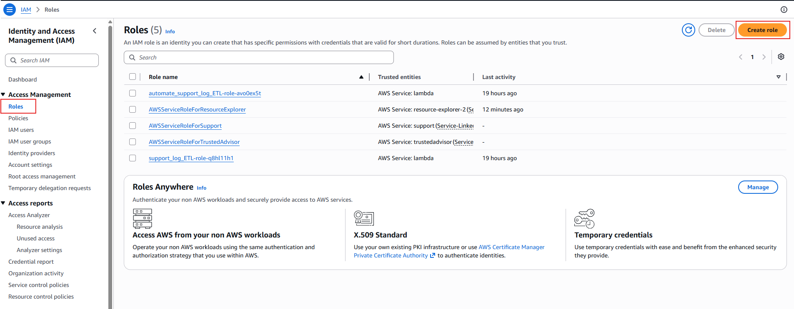
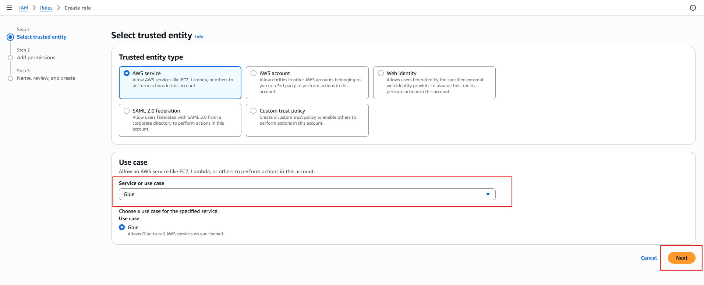

---

## Grant S3 Access

Attach policy:

```text
AmazonS3FullAccess
```

### 📸 Screenshot

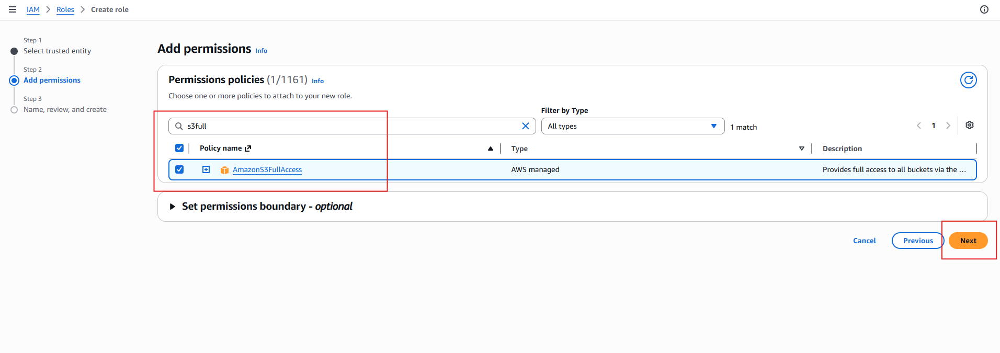

---

## Attach Glue Service Policy

Attach:

```text
AWSGlueServiceRole
```

### 📸 Screenshot

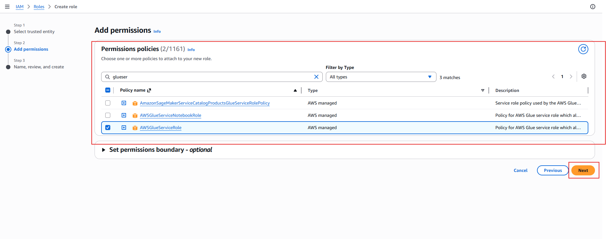

---

## Create Role

Role Name:

```text
glue_support_tickets
```

### 📸 Screenshot

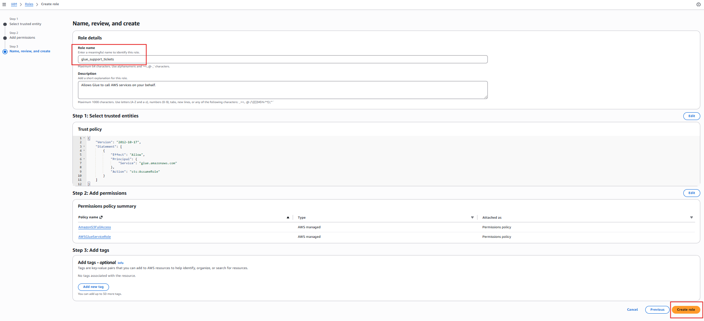

---

# 🔨 Step 2 – Create AWS Glue Visual ETL Job

Navigate to:

```text
AWS Glue → ETL Jobs
```

Select:

```text
Visual ETL
```

### 📸 Screenshot

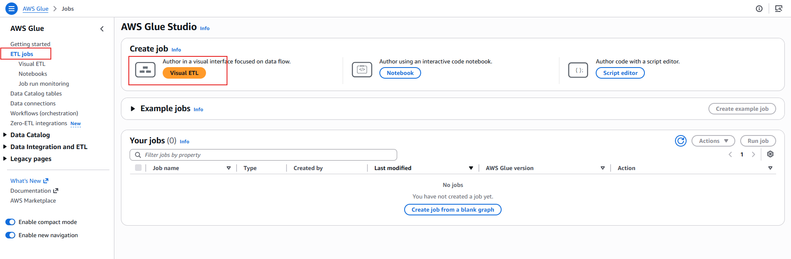

---

# 📥 Step 3 – Add Amazon S3 Source

Add Source Node:

```text
Amazon S3
```

### 📸 Screenshot

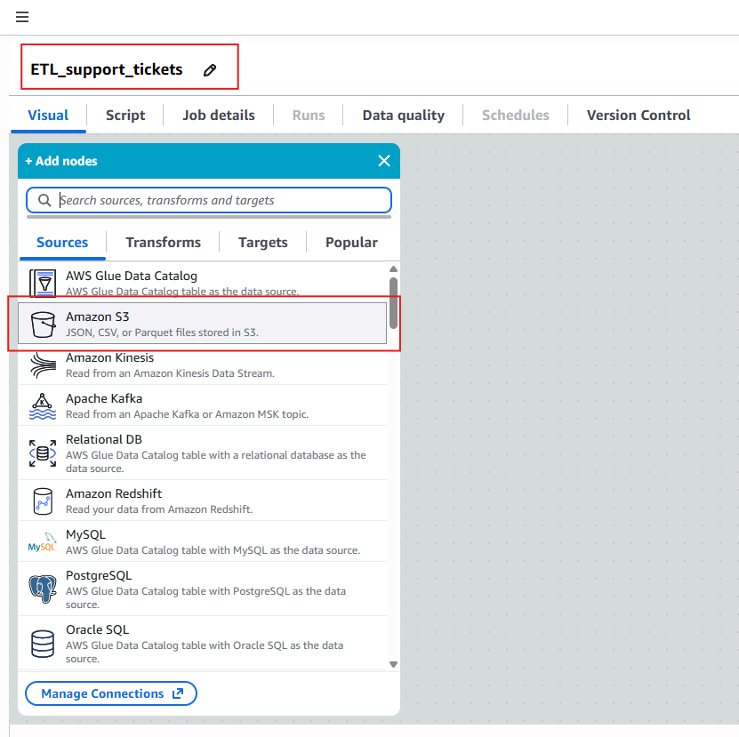

---

## Configure Source

| Setting     | Value                  |
| ----------- | ---------------------- |
| Source Type | Amazon S3              |
| Format      | CSV                    |
| IAM Role    | glue_support_tickets   |
| Recursive   | Enabled                |
| Location    | support-tickets folder |

### 📸 Screenshot

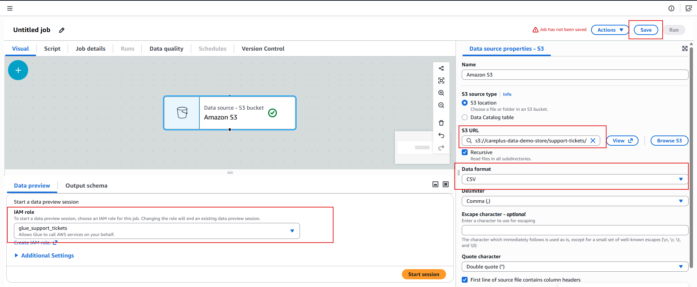

---

# 🔄 Step 4 – Change Schema

Add Transformation:

```text
Change Schema
```

Convert columns to proper data types.

| Column           | Type      |
| ---------------- | --------- |
| ticket_id        | string    |
| created_at       | timestamp |
| resolved_at      | timestamp |
| agent            | string    |
| priority         | string    |
| num_interactions | int       |
| issuecat         | string    |
| channel          | string    |
| status           | string    |
| agent_feedback   | string    |

### 📸 Screenshot

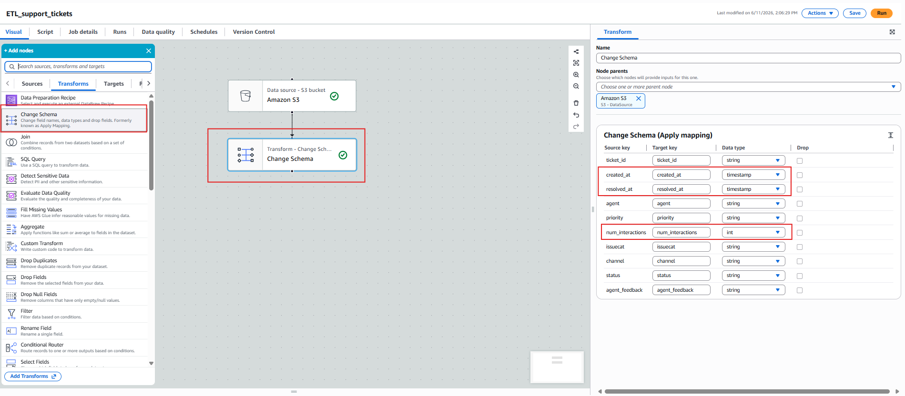

---

# 🧹 Step 5 – Remove Null Values

Transformation:

```text
Drop Null Fields
```

Options:

✅ Empty String

### 📸 Screenshot

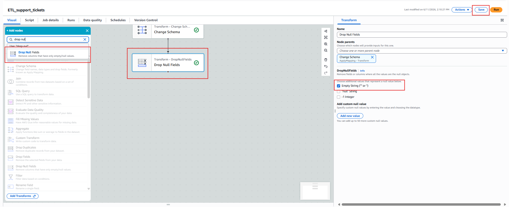

---

# 📝 Step 6 – Rename Column

Rename:

| Old Column | New Column     |
| ---------- | -------------- |
| issuecat   | issue_category |

### 📸 Screenshot


---

# 🔍 Step 7 – Filter Invalid Records

Transformation:

```text
Filter
```

Condition:

```sql
num_interactions >= 0
```

### 📸 Screenshot

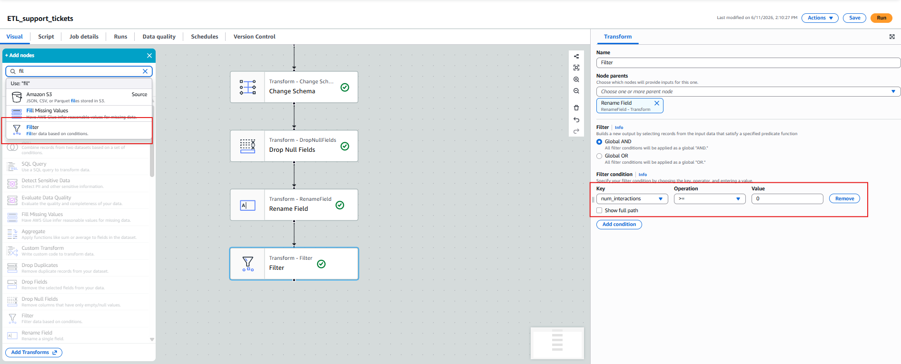

---

# ⚡ Step 8 – SQL Transformation

Transformation:

```text
SQL Query
```

### SQL Logic

```sql
SELECT *,
       CASE
           WHEN priority = 'Lw' THEN 'Low'
           WHEN priority = 'Medum' THEN 'Medium'
           WHEN priority = 'Hgh' THEN 'High'
           ELSE priority
       END AS priority
FROM myDataSource
```

### 📸 Screenshot


---

# 📦 Step 9 – Configure S3 Target

Add Target:

```text
Amazon S3
```

Configuration:

| Setting      | Value                     |
| ------------ | ------------------------- |
| Format       | Parquet                   |
| Compression  | Snappy                    |
| Output Files | 1                         |
| Location     | support-tickets/processed |

### 📸 Screenshot

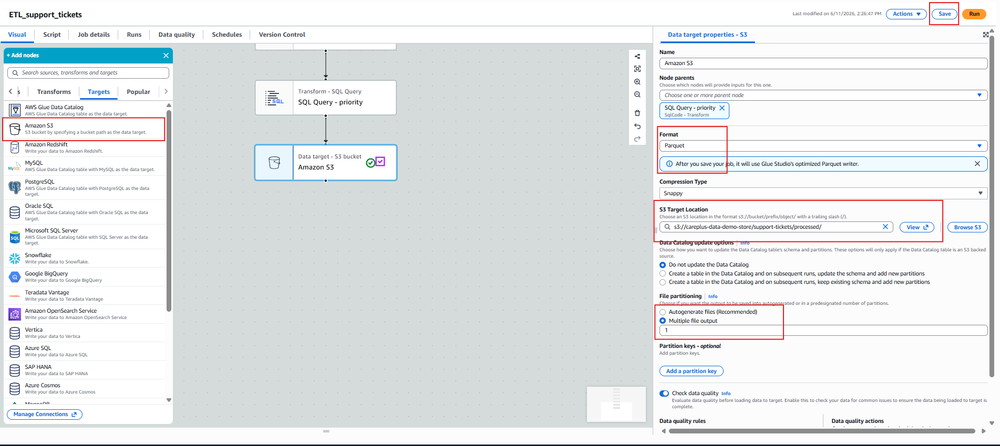

---

# ▶️ Step 10 – Run the Job

Save the ETL Job and click:

```text
Run
```

### 📸 Screenshot

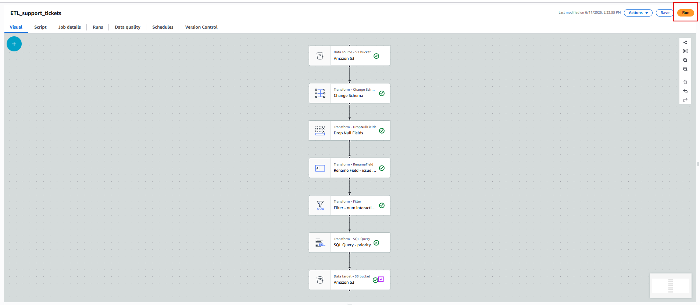

---

# 🎬 Final ETL Workflow

```text
Amazon S3
    │
    ▼
Change Schema
    │
    ▼
Drop Null Fields
    │
    ▼
Rename Field
    │
    ▼
Filter
    │
    ▼
SQL Query
    │
    ▼
Amazon S3 (Parquet)
```

---

# 📊 Input Dataset

| Column           |
| ---------------- |
| ticket_id        |
| created_at       |
| resolved_at      |
| agent            |
| priority         |
| num_interactions |
| issuecat         |
| channel          |
| status           |
| agent_feedback   |

---

# 📈 Output Dataset

| Column           |
| ---------------- |
| ticket_id        |
| created_at       |
| resolved_at      |
| agent            |
| priority         |
| num_interactions |
| issue_category   |
| channel          |
| status           |
| agent_feedback   |

---

# 💡 Benefits

✅ Automated ETL Pipeline

✅ Serverless Architecture

✅ No Infrastructure Management

✅ Optimized Storage Using Parquet

✅ Faster Athena Queries

✅ Reduced Storage Costs

✅ Production Ready

✅ Visual ETL Development

---

# 🛠 AWS Services Used

| Service         | Purpose                    |
| --------------- | -------------------------- |
| Amazon S3       | Data Storage               |
| AWS Glue        | ETL Processing             |
| IAM             | Access Management          |
| AWS Glue Studio | Visual ETL Development     |
| Parquet         | Optimized Analytics Format |

---

# 📚 Learning Outcomes

Through this project you will learn:

* AWS Glue Studio
* Visual ETL Design
* IAM Role Configuration
* S3 Integration
* Schema Mapping
* SQL Transformations
* Data Cleansing Techniques
* Parquet Optimization
* Production ETL Best Practices
