# 🚀 AWS Lambda ETL Pipeline


---

## 📖 Project Overview

This project demonstrates how to build a **Serverless ETL Pipeline** using:

- ⚡ AWS Lambda
- 🪣 Amazon S3
- 🔐 AWS IAM
- 🐼 Pandas Layer
- 📊 CloudWatch Logs


The Lambda function automatically:

* 📥 Reads support log files from Amazon S3
* 🧹 Cleans and transforms raw log data
* 🐼 Processes data using Pandas
* ⚡ Executes serverlessly using AWS Lambda
* 🔄 Triggers automatically whenever a new log file is uploaded

---

## 🏗️ Architecture

```text
┌─────────────────┐
│   Amazon S3     │
│   Raw Log File  │
└────────┬────────┘
         │
         ▼
┌─────────────────┐
│ S3 Notification │
└────────┬────────┘
         │
         ▼
┌─────────────────┐
│   AWS Lambda    │
└────────┬────────┘
         │
         ▼
┌─────────────────┐
│ Read Log File   │
└────────┬────────┘
         │
         ▼
┌─────────────────┐
│ Pandas Cleaning │
└────────┬────────┘
         │
         ▼
┌─────────────────┐
│ Processed Data  │
└─────────────────┘
```

---

## 🛠️ AWS Services Used

| Service       | Purpose                   |
| ------------- | ------------------------- |
| AWS Lambda    | Serverless ETL Processing |
| Amazon S3     | Store Raw Log Files       |
| IAM           | Access Management         |
| Lambda Layers | Pandas Dependency         |
| CloudWatch    | Monitoring & Logs         |

---

# Step 1️⃣ Create AWS Lambda Function

Navigate to:

```text
AWS Console → Lambda
```

Click **Create Function**.

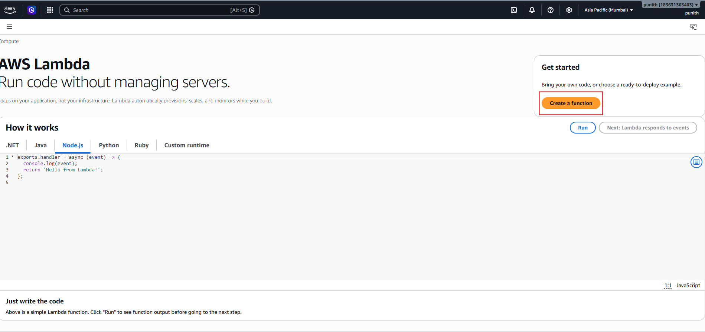

---

# Step 2️⃣ Configure Lambda Function

Configuration:

* Function Name: `support_log_ETL`
* Runtime: `Python 3.13`

Click **Create Function**.

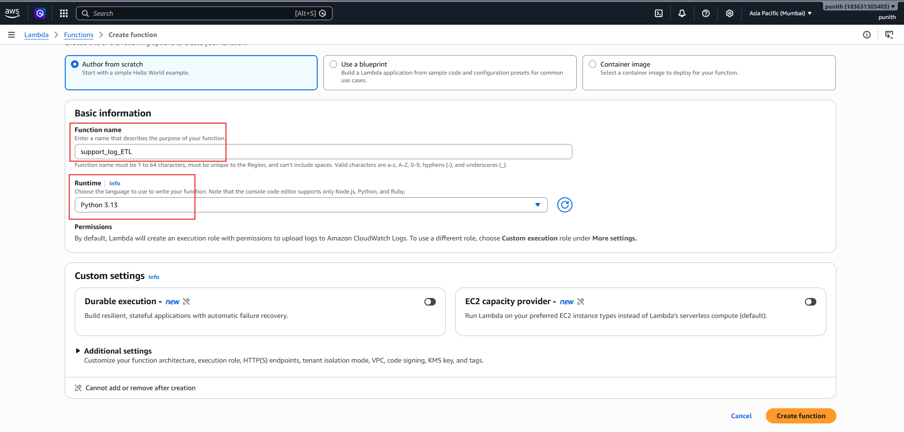

---

# Step 3️⃣ Open Lambda Code Editor

After creating the function, open the Lambda code editor.

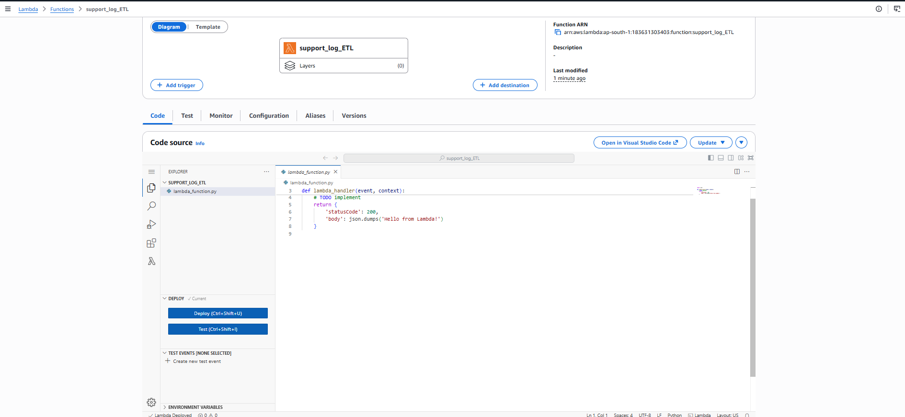

---

# Step 4️⃣ Test Lambda Function

Create a test event and execute the Lambda function.

Expected Output:

```json
{
  "statusCode": 200,
  "body": "\"Hello from Lambda!\""
}
```

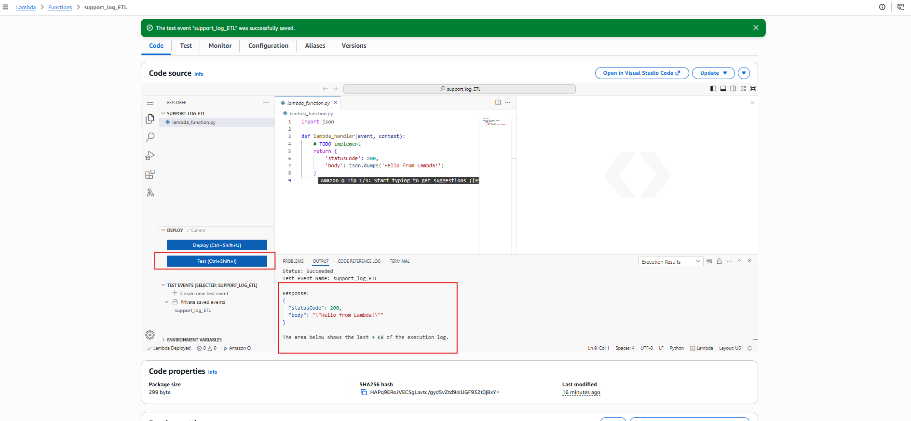

---

# Step 5️⃣ Read Log File From Amazon S3

Update Lambda code to fetch log files from Amazon S3.

Example:

```python
import boto3

def read_log_from_s3(bucket, key):
    s3 = boto3.client('s3')

    response = s3.get_object(
        Bucket=bucket,
        Key=key
    )

    return response['Body'].read().decode('utf-8')
```

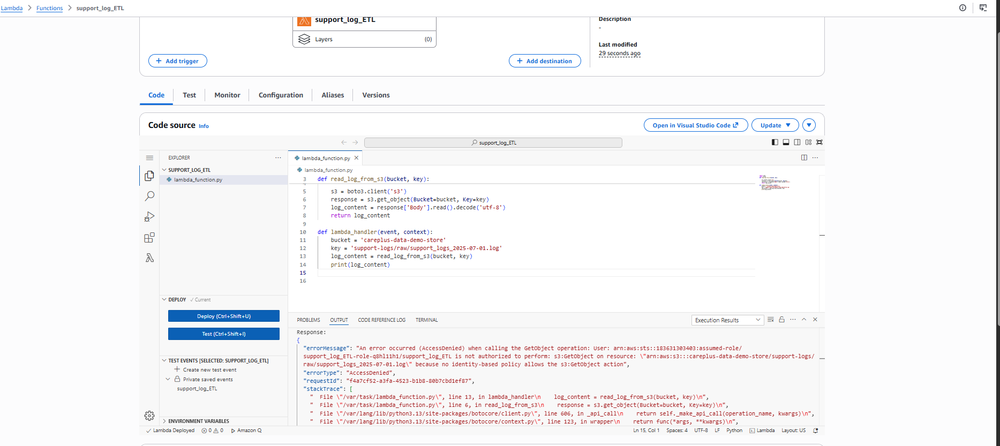

---

# Step 6️⃣ Fix IAM Permission Error

If Lambda does not have permission to access S3, you will receive an AccessDenied error.

Navigate to:

```text
IAM → Roles
```

Open the Lambda execution role.

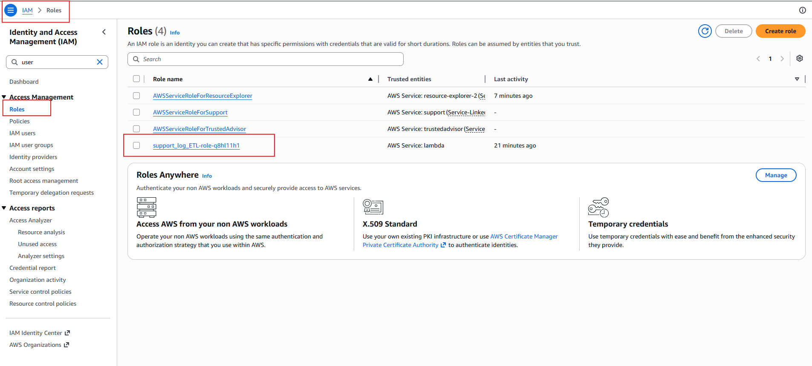

---

# Step 7️⃣ Add Required Permissions

Attach additional permissions to the Lambda execution role.

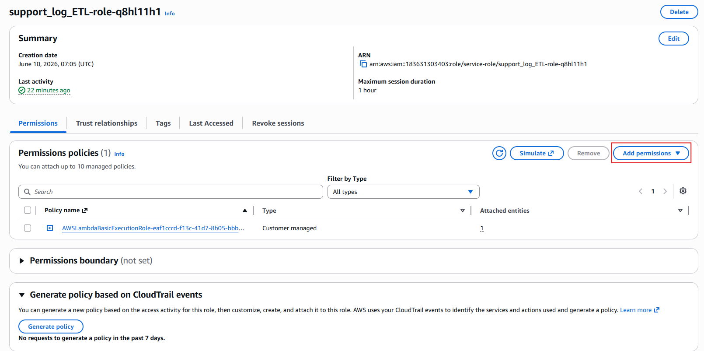

---

# Step 8️⃣ Attach Amazon S3 Policy

Attach:

```text
AmazonS3FullAccess
```

to the Lambda role.

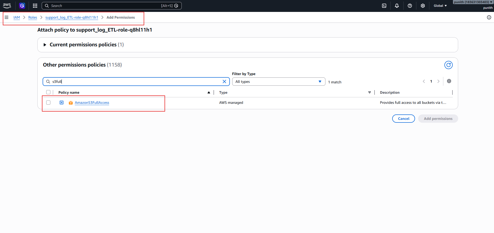

---

# Step 9️⃣ Fix Pandas Import Error

While processing data, Lambda may return:

```text
No module named 'pandas'
```

This happens because Pandas is not included in the default Lambda runtime.

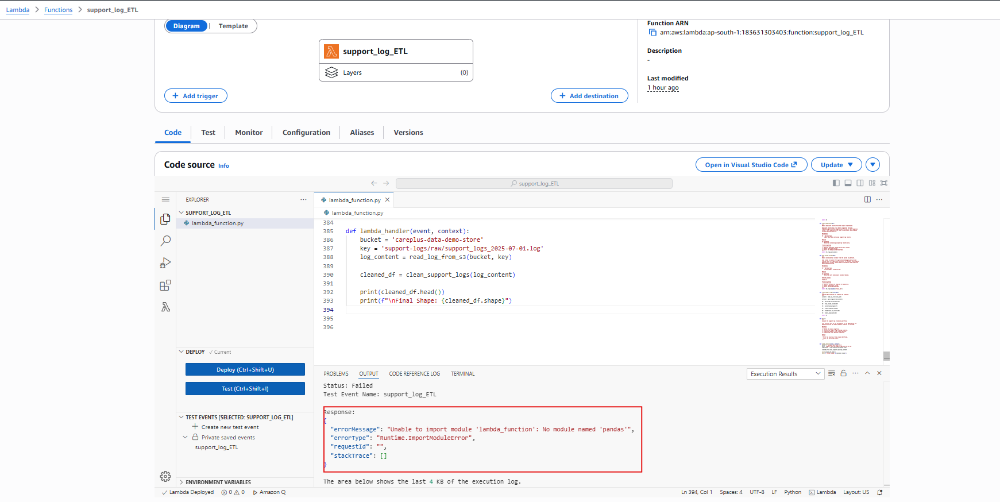

---

# Step 🔟 Add AWS Pandas Layer

Navigate:

```text
Configuration → Layers → Edit
```

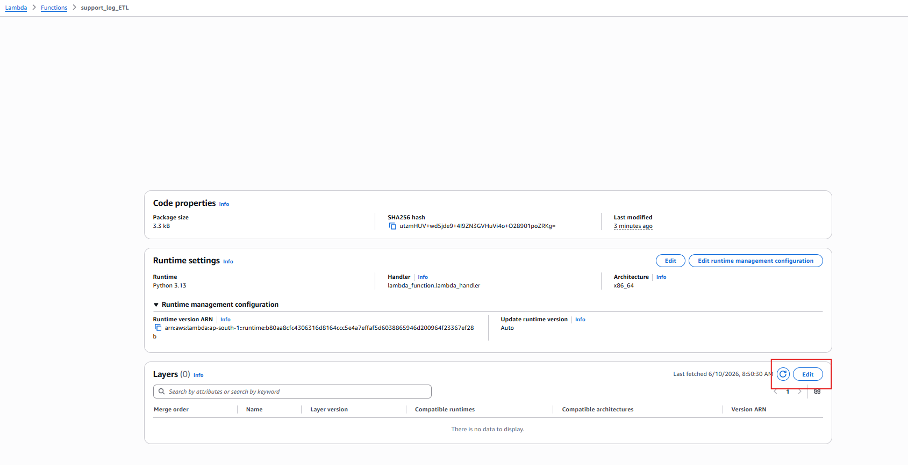

Choose:

```text
Layer:
AWSSDKPandas-Python313

Version:
12
```

Click **Add**.

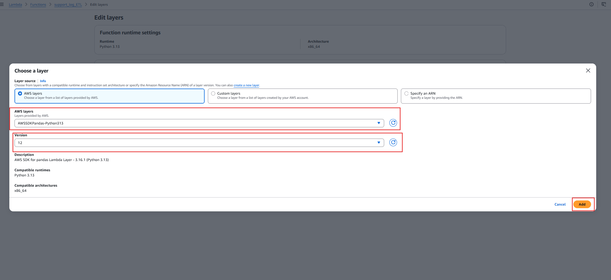

---

# Step 1️⃣1️⃣ Fix Lambda Timeout Error

Large log files may exceed the default Lambda timeout.

Error:

```text
Task timed out after 3.00 seconds
```

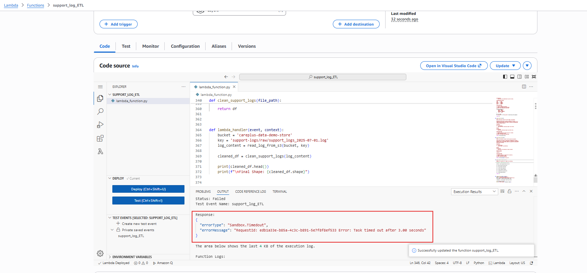

---

# Step 1️⃣2️⃣ Increase Lambda Timeout

Navigate:

```text
Configuration
    → General Configuration
```

Increase timeout:

```text
3 Seconds → 30 Seconds
```

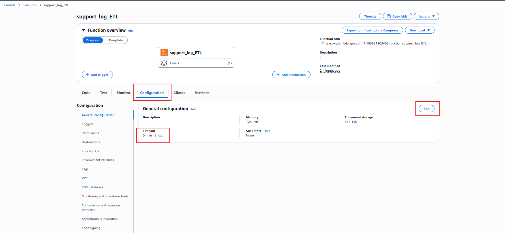

---

# Step 1️⃣3️⃣ Configure S3 Event Notification

Navigate to your S3 bucket.

```text
Amazon S3
    → Bucket
    → Properties
    → Event Notifications
```

Create a new event notification.

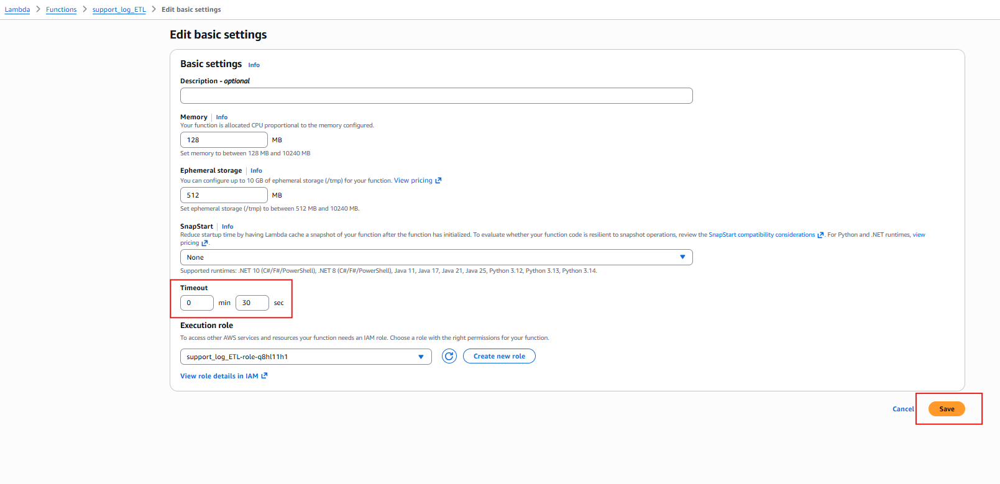

---

# Step 1️⃣4️⃣ Create Event Configuration

Configure:

| Setting    | Value                     |
| ---------- | ------------------------- |
| Event Name | trigger-automate-logs-ETL |
| Prefix     | support-logs/raw/         |
| Suffix     | .log                      |

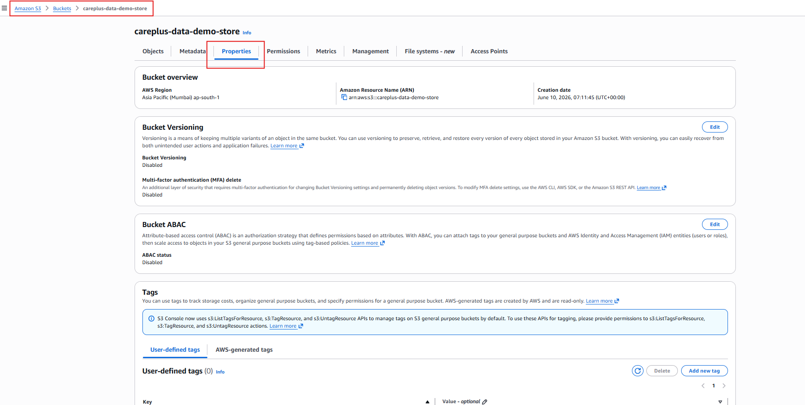

---

# Step 1️⃣5️⃣ Configure Event Type

Select:

* Object Creation
* PUT Event

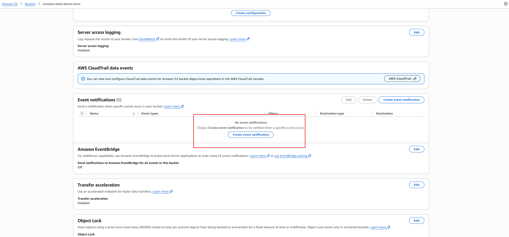

---

# Step 1️⃣6️⃣ Configure Event Notification Destination

Choose:

* Destination Type → Lambda Function
* Function → support_log_ETL

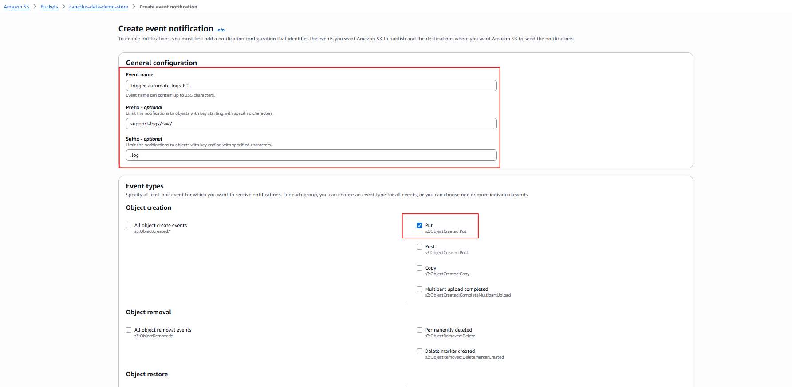

---

# Step 1️⃣7️⃣ Select Lambda Function

Select the Lambda function as the event destination.

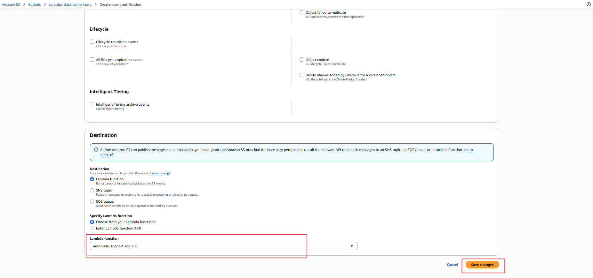

---

## 🎯 Final Workflow

```text
Upload Log File to S3
          │
          ▼
S3 Event Notification
          │
          ▼
AWS Lambda Trigger
          │
          ▼
Read Log File
          │
          ▼
Pandas Data Cleaning
          │
          ▼
Processed Dataset
```

---

## 📂 Repository Structure

```text
AWS_Lambda_Setup/
│
├── README.md
│
└── screenshots/
    ├── 01-create-lambda.png
    ├── 02-create-lambda-function.png
    ├── 03-open-vscode-in-aws.png
    ├── 04-test-lambda-function.png
    ├── 05-read-log-from-s3.png
    ├── 06-lambda-role-permission.png
    ├── 07-add-permissions.png
    ├── 08-attach-s3-policy.png
    ├── 09-import-error.png
    ├── 10-edit-layer.png
    ├── 11-add-pandas-layer.png
    ├── 12-timeout-error.png
    ├── 13-update-timeout.png
    ├── 14-create-event-notification.png
    ├── 15-create-event-automate.png
    ├── 16-create-event.png
    ├── 17-event-notification-config.png
    └── 18-select-lambda-function.png
```

---

## 🔥 Key Learnings

✅ AWS Lambda Fundamentals

✅ IAM Role Configuration

✅ Amazon S3 Integration

✅ Lambda Layers

✅ Pandas in AWS Lambda

✅ Event-Driven Architecture

✅ S3 Event Notifications

✅ Serverless ETL Design

---

