# 🚀 Amazon Redshift Serverless Setup and Data Loading Guide

This guide demonstrates how to create an Amazon Redshift Serverless environment, configure IAM permissions, create databases and tables, and load Parquet data directly from Amazon S3.

---

# 📋 Overview

Amazon Redshift is a fully managed cloud data warehouse that enables fast analytics using SQL on large datasets. In this setup, processed Parquet files stored in Amazon S3 are loaded into Amazon Redshift Serverless for analytics and reporting.

---

# 🏗️ Solution Architecture

```text
Amazon S3 (Parquet Files)
           │
           ▼
   IAM Role (S3 Access)
           │
           ▼
 Amazon Redshift Serverless
           │
           ▼
      Database
           │
           ▼
        Tables
           │
           ▼
     SQL Analytics
```

---

# 🚀 Step 1: Open Amazon Redshift

Navigate to Amazon Redshift from the AWS Console.

### Workflow

1. Open AWS Console
2. Search for Redshift
3. Open Amazon Redshift
4. Select Redshift Serverless
5. Start Serverless Setup

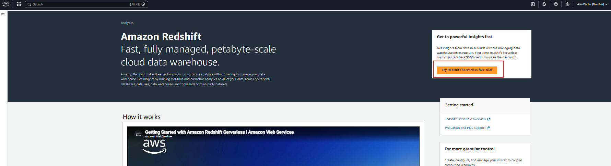

### Outcome

✅ Amazon Redshift Serverless setup started.

---

# 🚀 Step 2: Configure Redshift Serverless

Use the default configuration for quick setup.

### Workflow

1. Select **Use Default Settings**
2. Review namespace configuration
3. Create IAM Role

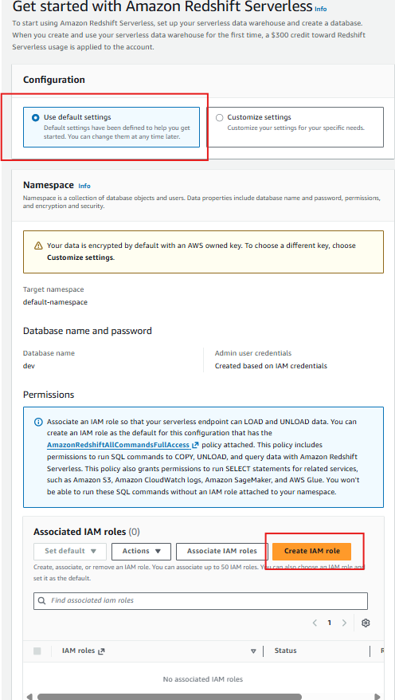

### Outcome

✅ Default namespace configuration selected.

---

# 🚀 Step 3: Create IAM Role

Grant Redshift access to Amazon S3.

### Workflow

1. Select **Full Access**
2. Choose **Any S3 Bucket**
3. Create IAM Role

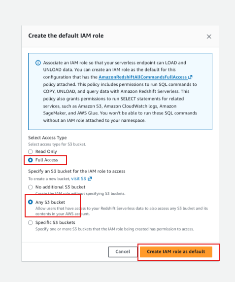

### Outcome

✅ IAM role created successfully.

---

# 🚀 Step 4: Complete Redshift Serverless Setup

Finish the setup process.

### Workflow

1. Review configuration
2. Wait for provisioning
3. Click Continue

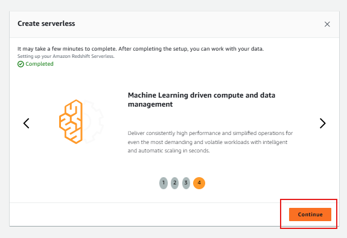

### Outcome

✅ Redshift Serverless environment created successfully.

---

# 🚀 Step 5: Open Namespace

Access the newly created namespace and workgroup.

### Workflow

1. Open Serverless Dashboard
2. Select Namespace
3. Verify Workgroup Status

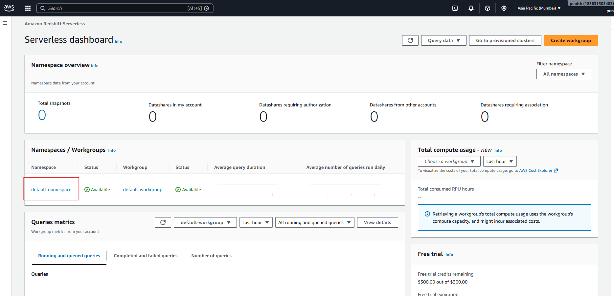

### Outcome

✅ Namespace and workgroup are available.

---

# 🚀 Step 6: Open Query Editor v2

Launch Redshift Query Editor.

### Workflow

1. Click **Query Data**
2. Select **Query in Query Editor v2**
3. Connect to the workgroup

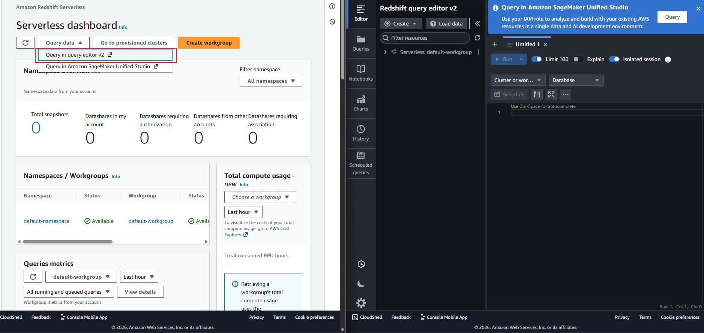

### Connection Configuration

Database:

```text
dev
```

### Outcome

✅ Query Editor connected successfully.

---

# 🚀 Step 7: Create Database

Create a dedicated database for analytics.

### SQL Command

```sql
CREATE DATABASE careplus_db;
```

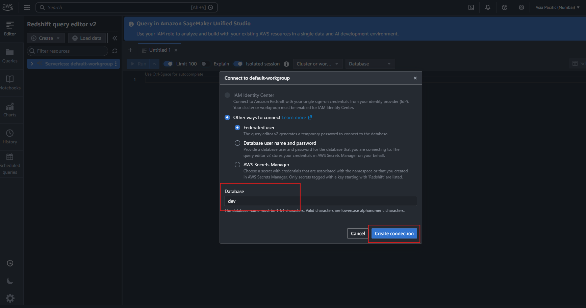

### Outcome

✅ Database created successfully.

---

# 🚀 Step 8: Verify Database Creation

Confirm database availability.

### Workflow

1. Refresh database tree
2. Expand Native Databases
3. Verify database creation

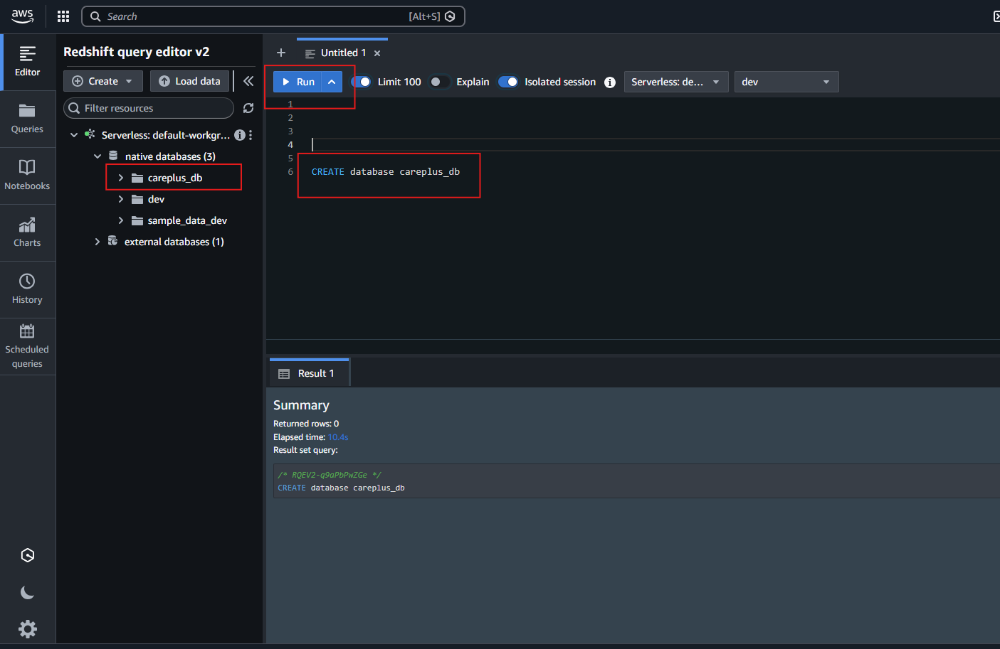

### Outcome

✅ Database visible in Redshift.

---

# 🚀 Step 9: Create Support Logs Table

Create a table matching the Parquet schema.

### SQL Command

```sql
CREATE TABLE public.support_logs (
    timestamp       TIMESTAMP,
    log_level       VARCHAR(20),
    component       VARCHAR(100),
    ticket_id       VARCHAR(50),
    session_id      VARCHAR(50),
    ip              VARCHAR(45),
    response_time   BIGINT,
    cpu             DOUBLE PRECISION,
    event_type      VARCHAR(50),
    error           BOOLEAN,
    user_agent      VARCHAR(300),
    message         VARCHAR(1000),
    debug           VARCHAR(1000)
);
```

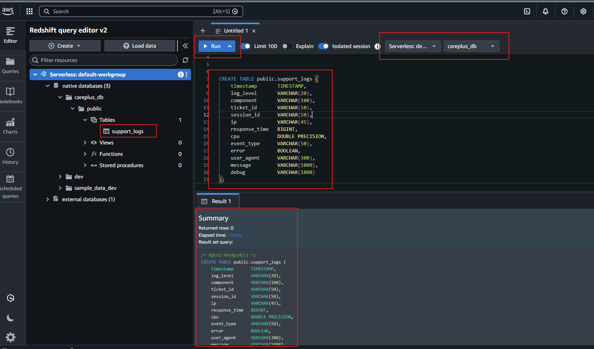

### Outcome

✅ Table created successfully.

---

# 🚀 Step 10: Copy Data from Amazon S3

Load Parquet files into Redshift.

### SQL Command

```sql
COPY public.support_logs
FROM 's3://careplus-data-demo-store/support-logs/processed/'
IAM_ROLE 'YOUR_REDSHIFT_IAM_ROLE_ARN'
FORMAT AS PARQUET
REGION 'ap-south-1';
```

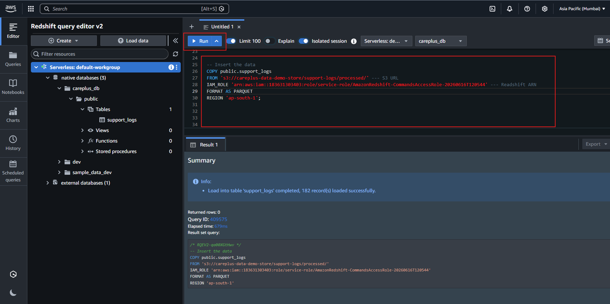

### Outcome

✅ Data loaded successfully into Redshift.

---

# 🚀 Step 11: Copy S3 URI

Retrieve the source location of processed Parquet files.

### Workflow

1. Open Amazon S3
2. Navigate to processed folder
3. Copy S3 URI

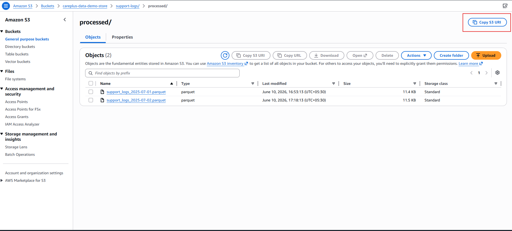

### Example

```text
s3://careplus-data-demo-store/support-logs/processed/
```

### Outcome

✅ S3 path copied successfully.

---

# 🚀 Step 12: Retrieve IAM Role ARN

Copy the IAM Role ARN used by Redshift.

### Workflow

1. Open IAM Console
2. Open Redshift IAM Role
3. Copy ARN

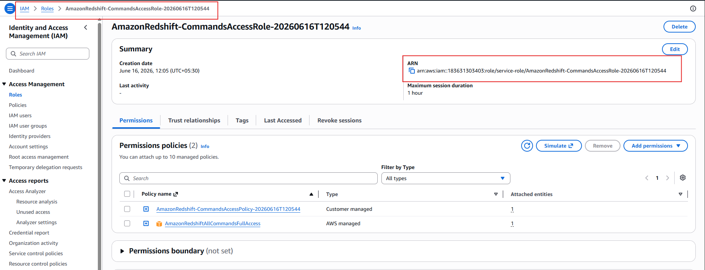

### Example

```text
arn:aws:iam::123456789012:role/service-role/AmazonRedshift-CommandsAccessRole
```

### Outcome

✅ IAM Role ARN ready for COPY command.

---

# 📊 Sample Queries

## Total Records

```sql
SELECT COUNT(*)
FROM public.support_logs;
```

---

## Average Response Time

```sql
SELECT AVG(response_time) AS avg_response_time
FROM public.support_logs;
```

---

## Records by Log Level

```sql
SELECT
    log_level,
    COUNT(*) AS total_records
FROM public.support_logs
GROUP BY log_level
ORDER BY total_records DESC;
```

---

## Top 10 Slowest Requests

```sql
SELECT
    ticket_id,
    response_time
FROM public.support_logs
ORDER BY response_time DESC
LIMIT 10;
```

---

## Error Records

```sql
SELECT *
FROM public.support_logs
WHERE error = TRUE;
```

---

# 💰 Cost Considerations

### Amazon Redshift Serverless

Charges are based on:

- Compute usage (RPU hours)
- Storage consumed

### Amazon S3

Charges apply for:

- Storage
- Requests
- Data transfer

---

# ✅ Benefits

### Amazon Redshift

- Fully Managed Data Warehouse
- Serverless Architecture
- High Performance Analytics
- SQL-Based Querying
- Scalable Compute Resources

### Amazon S3 Integration

- Direct Data Loading
- Low-Cost Storage
- Data Lake Compatibility

### Combined Solution

- Fully Serverless Analytics Platform
- Scalable Architecture
- Cost Efficient
- Enterprise Ready

---

# 🎯 Final Outcome

After completing this setup:

✅ Amazon Redshift Serverless created

✅ IAM permissions configured

✅ Analytics database created

✅ Support logs table created

✅ Parquet files loaded from Amazon S3

✅ SQL queries executed successfully

✅ Fully managed cloud data warehouse implemented