# 🪣 AWS S3 Setup and IAM Configuration

This guide walks through creating an Amazon S3 bucket, organizing folders, creating an IAM user, and generating access keys for programmatic access.

---

# 📚 Table of Contents

- Create an S3 Bucket
- Create Folder Structure
- Create IAM User
- Assign S3 Permissions
- Generate Access Keys
- Configure AWS CLI
- Verify Access

---

# 🎯 Objective

After completing this guide, you will have:

✅ An S3 Bucket

✅ Folder Structure for Data Engineering

✅ IAM User with S3 Access

✅ Access Key and Secret Key

✅ AWS CLI Ready for Use

---

# Step 1: Create an S3 Bucket

Navigate to:

```text
AWS Console → S3 → Buckets
```

Click **Create Bucket**.

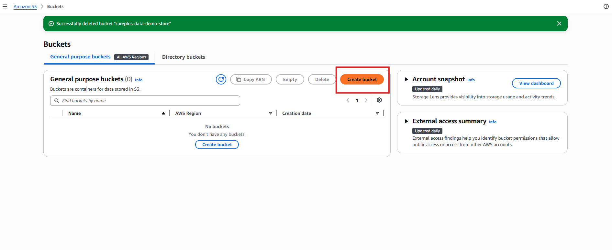

---

# Step 2: Enter Bucket Name

Provide a globally unique bucket name.

Example:

```text
careplus-data-demo-store
```

Choose your preferred AWS Region and click **Create Bucket**.

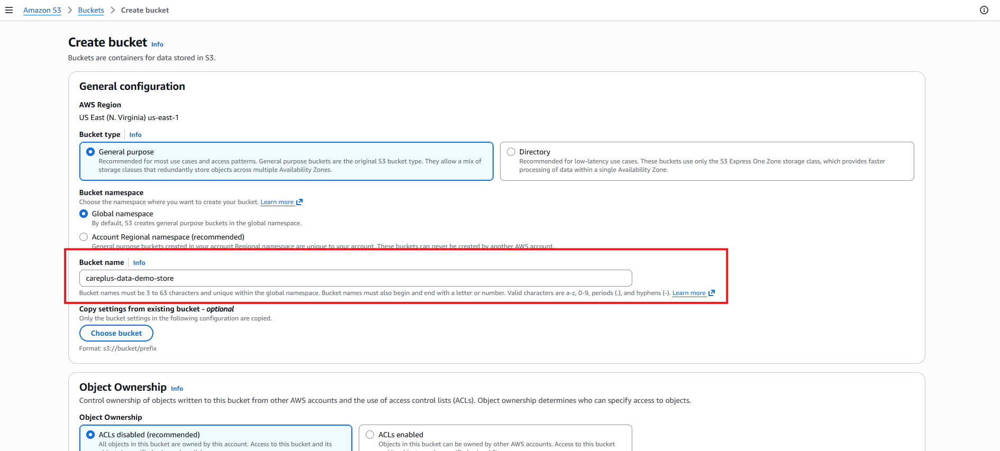

---

# Step 3: Open the Bucket and Create Folders

After creating the bucket, open it and click **Create Folder**.

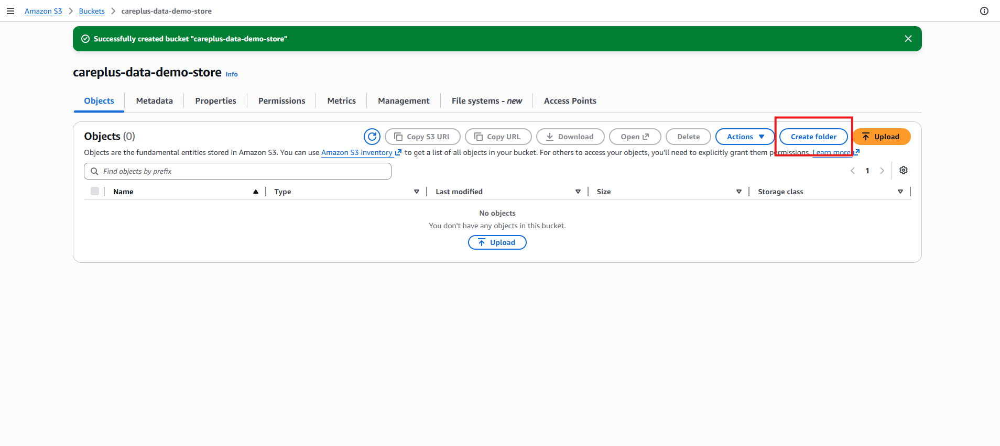

---

# Step 4: Create Folder Structure

Create folders to organize data.

Example:

```text
raw/
processed/
curated/
support-logs/
```

For this demo:

```text
support-logs
```

Click **Create Folder**.

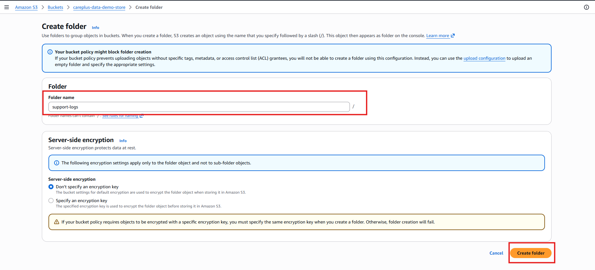

---

# Recommended Data Lake Structure

```text
careplus-data-demo-store/

support-logs/
├── processed/
└── raw/

support-tickets/
├── processed/
└── raw/
```

---

# Step 5: Create IAM User

Navigate to:

```text
AWS Console → IAM → Users
```

Click **Create User**.

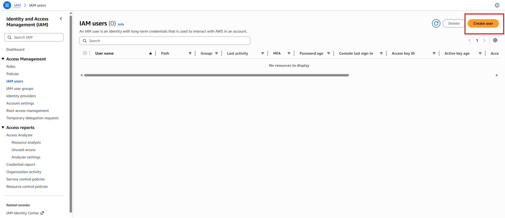

---

# Step 6: Enter User Name

Provide a meaningful user name.

Example:

```text
dev-ingestion-user
```

Click **Next**.

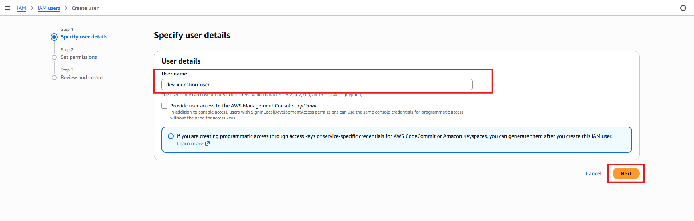

---

# Step 7: Assign Permissions

Choose:

```text
Attach policies directly
```

Search for:

```text
AmazonS3FullAccess
```

Select the policy and click **Next**.

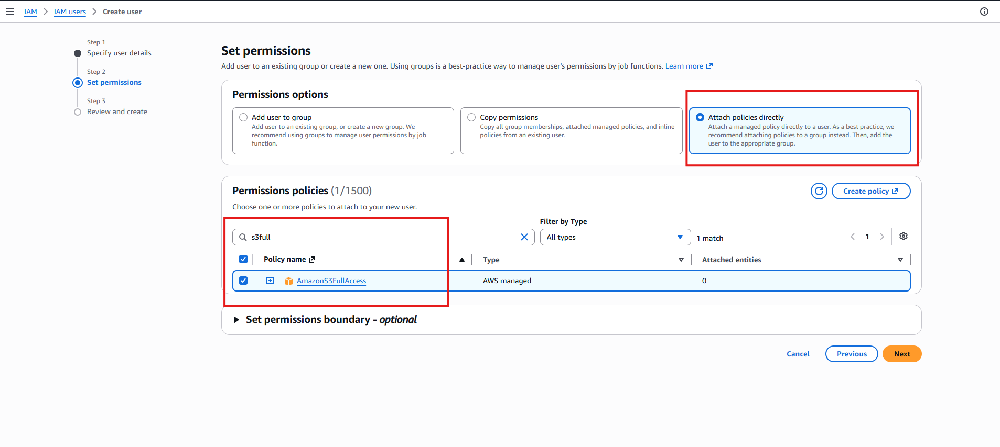

---

# Step 8: Review and Create User

Review the configuration and click:

```text
Create User
```

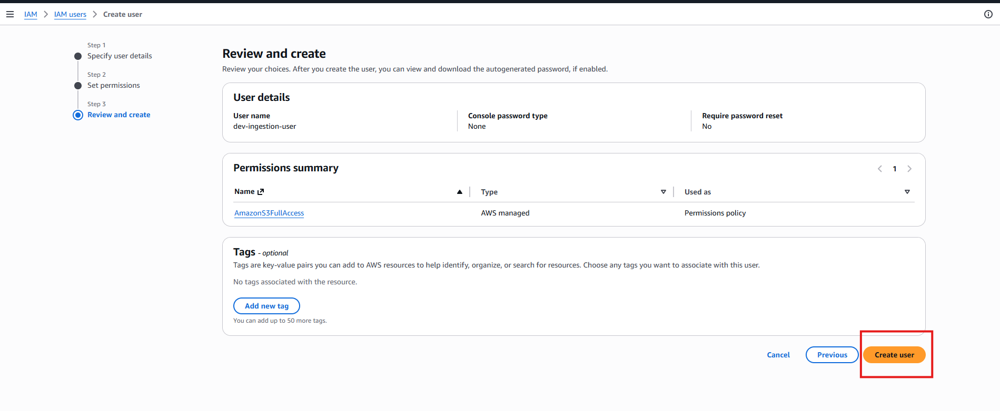

---

# Step 9: Create Access Key

Open the newly created IAM user.

Navigate to:

```text
Security Credentials
```

Click:

```text
Create Access Key
```

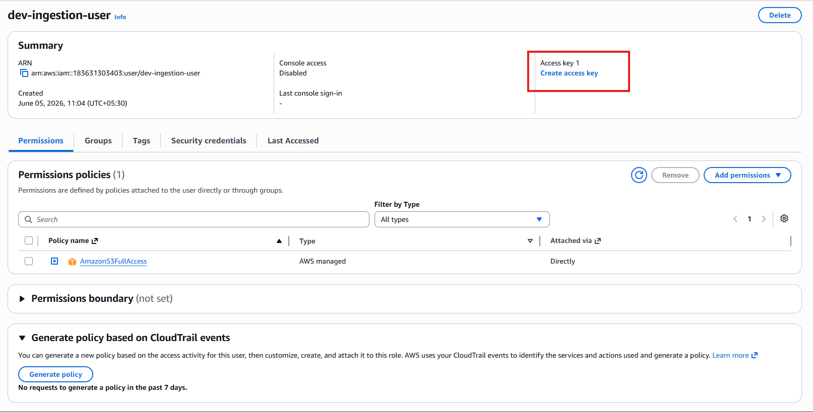

---

# Step 10: Select Access Key Use Case

Choose:

```text
Local Code
```

Check the confirmation checkbox.

Click **Next**.

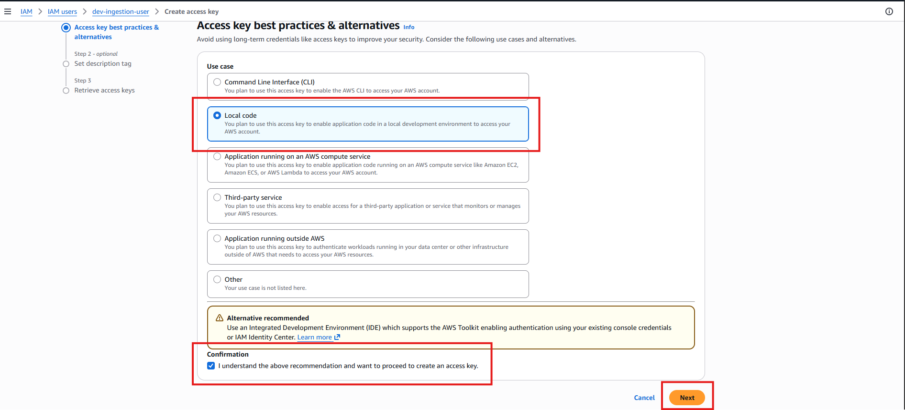

---

# Step 11: Add Description Tag

Provide a description.

Example:

```text
data ingestion from dev
```

Click:

```text
Create Access Key
```

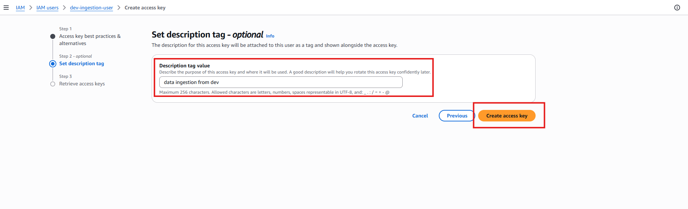

---

# Step 12: Save Access Key and Secret Key

AWS generates:

- Access Key ID
- Secret Access Key

⚠️ Important:

The Secret Access Key is displayed only once.

Download the CSV file or store the credentials securely.

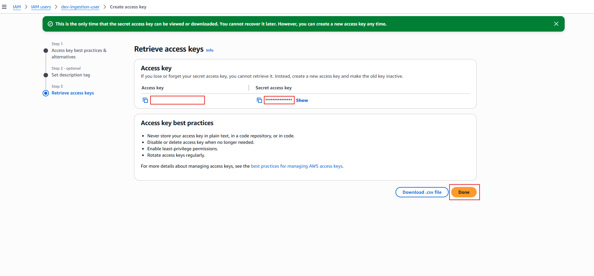

---

# 🎤 Interview Questions

### What is Amazon S3?

Amazon S3 is AWS's object storage service used for scalable and durable data storage.

### What is a Bucket?

A bucket is a container used to store objects in S3.

### Why create an IAM user instead of using the Root Account?

For security and least-privilege access control.

### What is an Access Key?

A credential used for programmatic access to AWS services.

### What is the difference between Access Key ID and Secret Access Key?

- Access Key ID identifies the user.
- Secret Access Key authenticates the user.

### Why is S3 commonly used in Data Engineering?

Because it serves as a scalable Data Lake for storing raw and processed data.

---

# 🏁 Key Takeaways

- Created an Amazon S3 bucket.
- Organized folders for a Data Lake.
- Created an IAM user.
- Assigned AmazonS3FullAccess permissions.
- Generated Access Keys.
- Verified connectivity to S3.
- Prepared the environment for ETL and Data Engineering projects.
